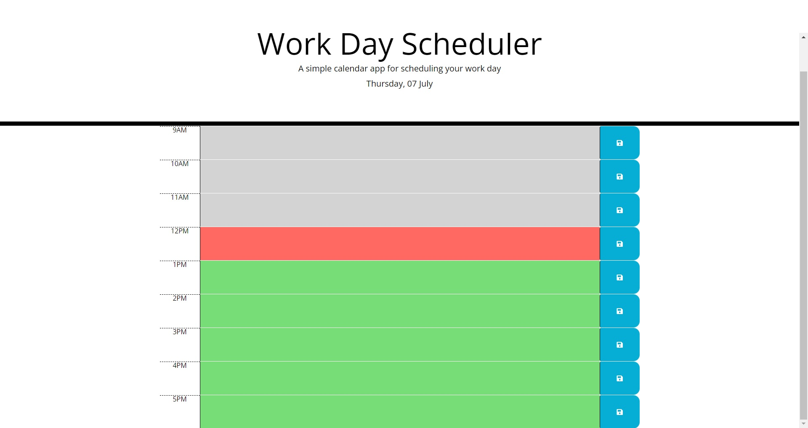

# Work-Day-Scheduler

## Description

This is a web site is used as a daily planner.

Any user with a busy schedule can add events and track them to manage their time effectively.
- The work day is broken into hour slots from 9 AM until 5 PM.
- You can enter an information into the text area for any given time block.
- When you have finished entering the data into your time block then you can save it by clicking the button on the same row as the time block.
- Once clicked the information in that time blocks text area will be saved to the browsers local storage.
- The each time block will be highlighted according to whether that time is in the past (grey), present (red), future (green).
- The highlighting on these time blocks are updated with the current time if the page remains open.

 

## Table of Contents

- [Deployed Link](#Link)
- [Screenshot](#Screenshot)
---

## Link

The link to the deployed website of the assignment is  
[https://jkoufalas.github.io/Work-Day-Scheduler/index.html](https://jkoufalas.github.io/Work-Day-Scheduler/index.html)

---
## Screenshot

This image provides a sample of the completed website.

